# Tutorial Maria DB dengan Docker Compose di Ubuntu

## Preparation
### Install Docker
- https://www.petanikode.com/docker-install/

### Install Docker Compose
- https://www.digitalocean.com/community/tutorials/how-to-install-and-use-docker-compose-on-ubuntu-20-04-id

### Belajar Docker
- https://www.niagahoster.co.id/blog/docker-tutorial/
- Docker CLI : https://github.com/triyasmkom/tutorial_repo/blob/master/docker-CLI.md

## Install MariaDB dan phpMyAdmin

Struktur Project: 

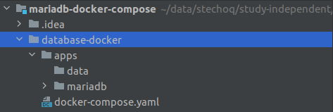

1. Buat folder baru, misalnya ```mariadb-docker-compose```.
    
    ```bash
   $ mkdir -p "mariadb-docker-compose/database-docker"
    ```


2. Masuk ke folder ```mariadb-docker-compose/database-docker``` dan buat file ```docker-compose.yml```.

   ```bash
   $ cd ./mariadb-docker-compose/database-docker
   $ cat > "docker-compose.yml"
   ```

3. Buka file ```docker-compose.yml``` dan masukkan script berikut ini:

   ```yaml
   version: '2'
   
   volumes:
     mariadb:
       driver: local
   
   networks:
     db:
       driver: bridge
   
   services:
     mariadb:
       image: mariadb:10.6
       restart: always
       environment:
         MYSQL_ROOT_PASSWORD: "12345"
         MYSQL_USER:  "root"
         MYSQL_PASSWORD: "12345"
       expose:
         - "40000"
       ports:
         - "40000:3306"
       volumes:
         - ./mariadb:/var/lib/mysql
         - ./data:/home/user/data
       networks:
         db:
   
     phpmyadmin:
       image: phpmyadmin
       restart: always
       expose:
         - "40001"
       ports:
         - "40001:80"
       environment:
         - PMA_HOST=mariadb
         - PMA_PORT=3306
       networks:
         db:
   ```   

4. Jalankan doker-compose menggunakan command line.

```bash
# masuk ke folder database-docker
$ cd "database-docker"

# Masuk ke mode root
$ sudo su

# Jalankan docker compose
$ docker-compose up -d

# Check docker compose
$ docker-compose ps

# Check docker container
$ docker container ls
$ docker container ls -a

# Menghentikan docker compose
$ docker-compose stop

# Masuk ke host docker
$ docker exec [options] [nama_host] [tipe command]

$ docker exec -it mariadb-test bash

# Pastikan CLI masuk ke dir yang ada file docker-compose.yml (config docker compose) 
# untuk start dan stop docker compose.


```

5. Silakan buka phpMyAdmin melalui browser dengan url http://localhost:40001

   Masukkan user dan password yang telah dibuat.
   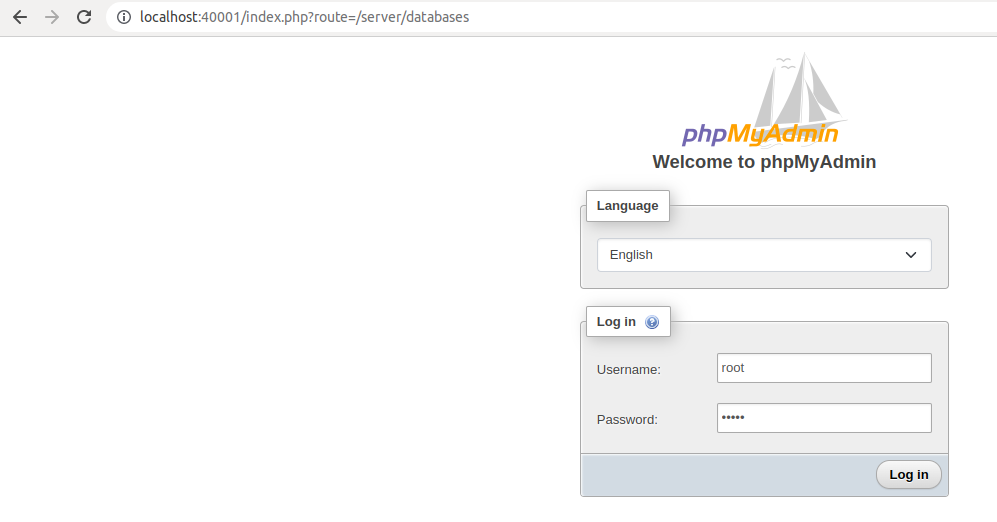
   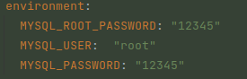
   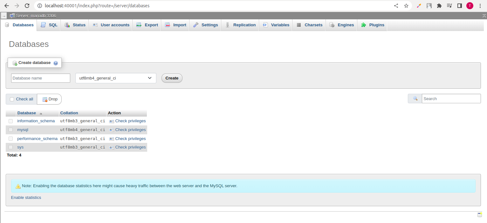

6. Instalasi mariadb dan phpmyadmin selesai.

   Sekarang mariadb dan phpmyadmin telah berjalan di host kita. Kita dapat melihat port di host kita.

   ```bash
   $ netstat -plntu
   
   ```

   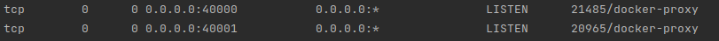

## Database Dasar

**Contoh Skema Database.** 

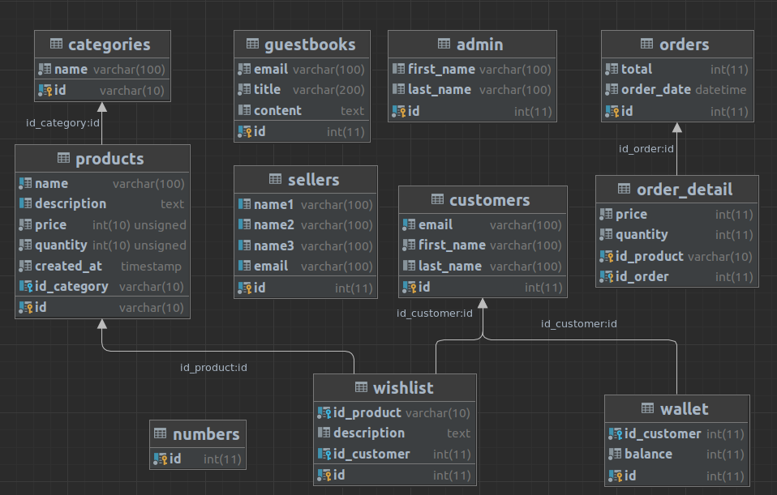

**Silakan gunakan command line dari workbench kesukaan anda.**

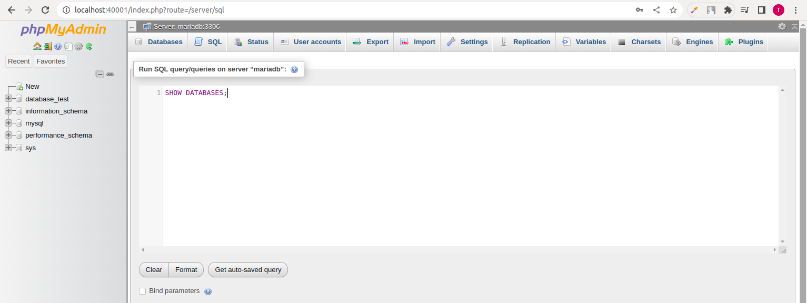

Output:
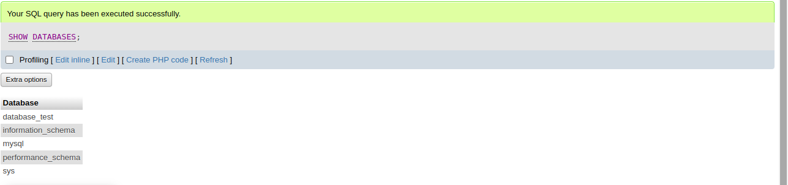

### Melihat, Membuat, Menghapus dan Memilih database.

```mysql
### Melihat semua database yang ada.
show databases;

### Membuat database
create database nama_db;

### Menghapus database
drop database nama_db;

### Memilih database
use database_test;

```

### Type Data
#### Type Data Number
1. Integer atau number bilangan bulat.

   | Type        | Length in Bytes | Min Value <br/>(Signed)   | Max Value <br/>(Signed) | Min Value <br/>(Unsigned) | Max Value<br/> (Unsigned) |
      |-------------|-----------------|----------------------|--------------------|----------------------|----------------------|
   | TYNYINT     | 1               | -128                 | 127                | 0                    | 255                  |
   | SMALLINT    | 2               | -32768               | 32767              | 0                    | 65535                |
   | MEDIUMINT   | 3               | -8388608             | 8388607            | 0                    | 16777215             |
   | INT         | 4               | -2147483648          | 2147483647         | 0                    | 4294967295           |
   | BIGINT      | 5               | -9223372036854775808 | 9223372036854775808| 0                    | 18446744073709551615 |


2. Floating Point atau number bilangan pecahan.

   | Type   | Length in Bytes | Min Value<br/> (Signed)  | Max Value<br/>(Signed)   | Min Value <br/>(Unsigned)      | Max Value <br/>(Unsigned) |
   |--------|-----------------|--------------------------|--------------------------|--------------------------------|---------------------------|
   | FLOAT  | 4               | -3.402823466E+38         | -1.175494351E-38         | 1.175494351E-38                | 3.402823466E+38           |
   | DOUBLE | 8               | -1.7976931348623157E+308 | -2.2250738585072014E-308 | 0, and 2.2250738585072014E-308 | 1.7976931348623157E+308   |

3. Decimal

   Ini type data khusu yang bisa ditentukan jumlah precision dan scale-nya.

   | DECIMAL      | Min     | Max    | Ket                                                     |
   |--------------|---------|--------|---------------------------------------------------------|
   | DECIMAL(5,2) | -999.99 | 999.99 | panjang digitnya 5, digit dibelakang koma 2             |
   | DECIMAL(5,0) | -99999  | 99999  | panjang digitnya 5, digit dibelakang koma tidak ada/nol |
   | DECIMAL(3,1) | -99.9   | 99.9   | panjang digitnya 3, digit dibelakang koma 1             |
   | DECIMAL(3)   | -999    | 999    | panjang digitnya 5, digit dibelakang koma 2             |

4. Number Attribut
   
   | Types    | Deskripsi                                    |
   |----------|----------------------------------------------|
   | TIPE(N)  | INT(3) >> integer sebanyak 3 digit misal 777 |
   | ZEROFILL | INT(3) ZEROFILL, nilainya 7 akan tampil 007  |

#### Type data String
1. Char dan Varchar
   - CHAR(10) atau VARCHAR(10) --> max karakternya 10.
   - CHAR atau VARCHAR ukuran max hanya 65535 karakter.
   
2. Text

   | Type       | Max                 | Memory     |
   |------------|---------------------|------------| 
   | TINYTEXT   | 255 karakter        | ~256 bytes |
   | TEXT       | 65535 karakter      | ~64 kb     |
   | MEDIUMTEXT | 16777215 karakter   | ~16 MB     |
   | LONGTEXT   | 4294967295 karakter | ~4 GB      |

#### Type data Enum

Enum adalah type data sring yang bisa kita tentukan pilihannya.

Contoh:
```mysql
# Hanya bisa menerima data Pria atau wanita
Enum('Pria', 'Wanita')
```

#### Type data Date dan Time

| Type      | Format              | Contoh              |
|-----------|---------------------|---------------------|
| DATE      | YYYY-MM-DD          | 2020-11-13          |
| DATETIME  | YYYY-MM-DD HH:MM:SS | 2020-11-13 06:33:45 |
| TIMESTAMP | YYYY-MM-DD HH:MM:SS | 2020-11-13 06:33:45 |
| TIME      | HH:MM:SS            | 07:25:45            |
| YEAR      | YYYY                | 2020                |

#### Type Data Boolean
Boolean -> type data kebenaran yaitu TRUE (benar), FALSE(salah)

#### Type Data Lainnya
Seperti misal type data BLOB, SPATIAL, JSON, SET dan lain-lain. Bisa liat di dokumentasi resminya Mysql https://dev.mysql.com/doc/refman/8.0/en/data-types.html.

### Table

```mysql
# melihat engine
show engines;

# melihat table
show tables ;

```
#### Membuat table
```mysql
# Membuat tabel
create table barang(
                      kode int,
                      nama varchar(100),
                      harga int,
                      jumlah int
) ENGINE = InnoDB;
```

#### Melihat struktur tabel

```mysql
# melihat desktipsi struktur table
desc barang;

describe barang;

# melihat struktur query pembuatan tabel
show create table barang;
```

#### Mengubah Tabel

```mysql
alter table barang
#   menambah kolom
    add column nama_column text,
#   menghapus kolom
    drop column nama,
#   mengubah nama
    rename column nama to nama_baru,
#   mengubah posisi kolom
    modify nama varchar(100) after jumlah,
    modify nama varchar(100) first;
```

```mysql
# menambahkan kolom
alter table barang add column salah text;
# hapus kolom
alter table barang drop column salah;
# menambahkan kolom
alter table barang add column deskripsi text;
# rename kolom
alter table barang rename column deskripsi to deskripsi2;
# Ubah type data kolom
alter table barang modify deskripsi2 varchar(200);
# Ubah posisi kolom
alter table barang modify  deskripsi2 varchar(200) after nama;
# Ubah posisi kolom
alter table barang modify deskripsi2 varchar(200) first;
# Ubah menjadi NOT NULL
alter table barang modify kode int NOT NULL;
```

#### Default Value

```mysql
# menambahkan default value
create table barang(
    kode int not null,
    nama varchar(100),
    harga int not null default 0,
    jumlah int not null default 0
) ENGINE = InnoDB;

# mengubah default value
alter table barang
   modify jumlah int not null default 0;

# mengubah default value timestamp
alter table barang
   add column created_at timestamp not null default current_timestamp;
```

#### Membuat ulang tabel
Menghapus semua data dalam tabel dan membuat table baru.

```mysql
truncate nama_tabel;
```

#### Menghapus tabel

```mysql
drop table nama_tabel;
```


### Insert Data
Buat table products:

```mysql
create table products(
    id varchar(10) not null unique,
    name varchar(100) not null,
    description text,
    price int unsigned not null default 0,
    quantity int unsigned not null default 0,
    created_at timestamp not null default current_timestamp
) engine = InnoDB;
```

Memasukkan data

```mysql
insert into products(id, name, price, quantity)
values ('P001','Mie Ayam Original',15000, 100);

insert into products(id, name, price, description, quantity)
values ('P002','Mie Ayam Bakso',20000,'Mie ayam original + bakso', 100);

insert into products(id, name, price, description, quantity)
values ('P003','Mie Ayam Ceker',20000,'Mie ayam original + ceker', 100),
       ('P004','Mie Ayam Spesial',25000,'Mie ayam original + ceker + bakso', 100),
       ('P005','Mie Ayam Yamin',15000,'Mie ayam yamin', 100)
;
```
### Select Data

```mysql
# mengambil semua kolom
select * from products;

# mengambil berdasarkan nama kolom
select id, name, price, quantity
from products;

```

### Primary Key

```mysql
create table products(
    id varchar(10) not null unique,
    name varchar(100) not null,
    description text,
    price int unsigned not null default 0,
    quantity int unsigned not null default 0,
    created_at timestamp not null default current_timestamp,
    primary key (id)
) engine = InnoDB;

alter table products add primary key (id);
```

### Where Clause

```mysql
select * from products
where quantity = 100;
```

### Update

```mysql
# tambah kolom
alter table products
   add column category enum('Makanan', 'Minuman', 'Lain-lain')
      after name;


# update single column
update products set category = 'Makanan'
where id = 'P002';

# multiple column
update products set category = 'Makanan', description = 'Mie ayam original'
where id = 'P001';

# update price
update products set price = price + 5000
where id = 'P005';
```

### Menghapus Data

```mysql
delete from products where id = 'P003';
```


### Alias

```mysql
# alias nama kolom
select 
    id as kode,
    name as nama
from products;

# alias nama tabel
select
   p.id as kode,
   p.name as nama
from products p;
```

### Where Operator
#### Operator Perbandingan

| Operator   | Keterangan              |
|------------|-------------------------|
| =          | sama dengan             |
| <> atau != | tidak sama dengan       |
| <          | kurang dari             |
| <=         | kurang dari sama dengan |
| >          | lebih dari              |
| >=         | lebih dari sama dengan  |

```mysql
# Tambah data terlebih dahulu
insert into products(id, name, price, quantity, products.category)
values ('P003','Bakso Rusuk',25000, 200, 'Makanan'),
       ('P006','Es Jeruk',10000, 300, 'Minuman'),
       ('P007','Es Campur',15000, 500, 'Minuman'),
       ('P008','Es Teh Manis',5000, 400, 'Minuman'),
       ('P009','Teh Panas',5000, 400, 'Minuman'),
       ('P010','Kerupuk',2500, 1000, 'Lain-lain'),
       ('P011','Keripik Udang',10000, 300, 'Lain-lain'),
       ('P012','Es Krim',5000, 200, 'Lain-lain'),
       ('P013','Mie Ayam Jamur',20000, 50, 'Makanan'),
       ('P014','Bakso Telur',20000, 150, 'Makanan'),
       ('P015','Bakso Janda',20000, 300, 'Makanan');
```
```mysql
select * from products where quantity > 100;

select * from products where quantity >= 100;

select * from products where category != 'Makanan';

```

#### Operator Logika
```mysql
# and
select * from products where quantity > 100 and price > 15000; 

# or 
select * from products where category = "Makanan" or price > 15000;

# Prioritas ()
select * from products
         where (category = 'Makanan' or quantity > 10000) and price > 15000; 
```


#### Operator Like 
Tidak disarankan dengan data yang besar, karena sangat lambat scanning dari atas sampai bawah.

| Operator     | Result                  |
|--------------|-------------------------|
| LIKE 'b%'    | String dengan awalan b  |
| LIKE '%a'    | String dengan akhiran a |
| LIKE '%abc%' | String yang berisi abc  |
| NOT LIKE     | tidak LIKE              |


```mysql
select * from products
where like '%mie%';
```


#### Operator NULL

```mysql
select * from products
where description is null;

select * from products
where description is not null;
```

#### Operator Between

```mysql
select * from products
where price between 10000 and 20000;

select * from products
where price not between 10000 and 20000;
```


#### Operator In

```mysql
select * from products
where category in ('Makanan', 'Minuman');

select * from products
where category not in ('Makanan', 'Minuman');
```

### Order By Clause (diurutkan)

```mysql
select * from product
order by price asc, id desc;

select * from products
where price > 10000
order by price asc, id desc;
```

### Limit Clause

```mysql
select * from products
where price > 10000
order by price
limit 2;

# atau 
select * from products
where price > 10000
order by price
limit 0, 2

# limit page 1
select * from products
where price > 10000
order by price
limit 0, 5;

# limit page 2
select * from products
where price > 10000
order by price
limit 5, 5;

# limit page 3
select * from products
where price > 10000
order by price
limit 10, 5;

# limit page 4
select * from products
where price > 10000
order by price
limit 15, 5;
```


### Select Distinct Data
Menghilangkan data duplicate.

```mysql
select distinct category from products;
```


### Numeric Function

#### Arithmetic Operator

| Name   | Description                               |
|--------|-------------------------------------------|
| %, MOD | Modulo operator - sisa bagi               |
| *      | Multiplication operator                   |
| +      | Addition operator - penjumlahan           |
| -      | Minus operator - pengurangan              |
| -      | Change the sign of the argument - negatif |
| /      | Division operator - pembagian             |
| DIV    | Intger Division operator                  |


```mysql
# Menggunakan aritmetic operator
select 10, 3, 10 * 10 as hasil;

select id, name, price div 1000 as 'Price in Key' from products;
```

#### Matematical Function

details : https://dev.mysql.com/doc/refman/8.0/en/mathematical-functions.html

| Name	       | Description                                                    |
|-------------|----------------------------------------------------------------|
| ABS()       | Return the absolute value                                      |
| ACOS()	     | Return the arc cosine                                          |
| ASIN()	     | Return the arc sine                                            |
| ATAN()	     | Return the arc tangent                                         |
| ATAN2(),    | ATAN()	Return the arc tangent of the two arguments             |
| CEIL()	     | Return the smallest integer value not less than the argument   |
| CEILING()	  | Return the smallest integer value not less than the argument   |
| CONV()	     | Convert numbers between different number bases                 |
| COS()	      | Return the cosine                                              |
| COT()	      | Return the cotangent                                           |
| CRC32()	    | Compute a cyclic redundancy check value                        |
| DEGREES()	  | Convert radians to degrees                                     |
| EXP()	      | Raise to the power of                                          |
| FLOOR()	    | Return the largest integer value not greater than the argument |
| LN()	       | Return the natural logarithm of the argument                   |
| LOG()	      | Return the natural logarithm of the first argument             |
| LOG10()	    | Return the base-10 logarithm of the argument                   |
| LOG2()	     | Return the base-2 logarithm of the argument                    |
| MOD()	      | Return the remainder                                           |
| PI()	       | Return the value of pi                                         |
| POW()	      | Return the argument raised to the specified power              |
| POWER()	    | Return the argument raised to the specified power              |
| RADIANS()	  | Return argument converted to radians                           |
| RAND()	     | Return a random floating-point value                           |
| ROUND()	    | Round the argument                                             |
| SIGN()	     | Return the sign of the argument                                |
| SIN()	      | Return the sine of the argument                                |
| SQRT()	     | Return the square root of the argument                         |
| TAN()	      | Return the tangent of the argument                             |
| TRUNCATE()	 | Truncate to specified number of decimal places                 |

```mysql
# menggunakan fungsi matematika
select id, cos(price), sin(price), tan(price), price from products;

select * from products
where price div 1000 > 15;
```


### Auto Increment
Generate angka secara berurutan.

```mysql
# create tabel admin
create table admin (
    id int not null auto_increment,
    first_name varchar(100),
    last_name varchar(100),
    primary key (id)
) engine = InnoDB;


# insert data
insert into admin(first_name, last_name)
VALUES ('Mark','John'),
       ('Smith','Andreas');

# Check last insert id
select last_insert_id();

```

### String Function
Lihat dokumentasi: https://dev.mysql.com/doc/refman/8.0/en/string-functions.html

```mysql
# menggunakan string function
select id,
       lower(name) as 'Name Lower',
       length(name) as 'Name Length'
       from products;
```

### Date and Time Function

Lihat dokumentasi: https://dev.mysql.com/doc/refman/8.0/en/date-and-time-functions.html

```mysql
# menggunakan fungsi datetime
select id,
       extract(year from created_at) as year,
       extract(month from created_at)
from products;

# simple
select id, year(created_at), month(created_at)
from products;

```

### Flow Control Flow
Lihat dokumentasi: https://dev.mysql.com/doc/refman/8.0/en/flow-control-functions.html

```mysql
# case (jika "makanan" maka "enak", jika "minuman" maka "segar", selain itu "apa itu?")
select id,
       case category
          when 'Makanan' THEN 'Enak'
          when 'Minuman' then 'Segar'
          else 'Apa itu?'
          end as category
from products;

# if
select id,
       price,
       if(price <= 15000, 'Murah',
          if(price <=20000, 'Mahal',
             'Mahal Banget')) as 'Mahal?'
from products;


# ifnull
select id,
       name,
       ifnull(description, 'Kosong') as description
from products;
```


### Aggregate Function
Lihat dokumentasi: https://dev.mysql.com/doc/refman/8.0/en/aggregate-functions.html

```mysql
# count
select count(id) as total_product from products;

# avg
select avg(price) as 'rata-rata' from products;

# max
select max(price) as 'harga termahal' from products;

# min
select min(price) as 'harga termurah' from products;
```

### Grouping (Group By)
Lihat dokumentasi: https://dev.mysql.com/doc/refman/8.0/en/group-by-modifiers.html

```mysql
# count
select 
    count(id) as total_product, 
    products.category 
from products 
group by products.category;

# avg
select 
    avg(price) as 'rata-rata', 
    products.category 
from products 
group by products.category;

# max
select 
    max(price) as 'harga termahal', 
    products.category 
from products 
group by products.category;

# min
select 
    min(price) as 'harga termurah', 
    products.category 
from products 
group by products.category;

```

### Having Clause

```mysql
# menggunakan having clause
select
    count(id) as total_product,
    products.category
from products
group by products.category
having total_product > 5;
```

### Constraint
- untuk mevalidasi inputan yang salah dari program kita.
- menjaga data di tabel tetap baik.

#### Unique Constraint

```mysql
# membuat constraint
create table customers(
                         id int not null auto_increment,
                         email varchar(100) not null,
                         first_name varchar(100) not null ,
                         last_name varchar(100),
                         primary key (id),
                         unique key email_unique(email)
) engine = InnoDB;

# menambahkan constraint
alter table customers
add constraint email_uniques unique (email);

# delete constraint
alter table customers
drop constraint email_unique;

# coba insert 2 kali
insert into customers(email, first_name, last_name)
values ('test@gmail.com', 'smith', 'john');

```
#### Check constraint
constraint yang bisa kita tambahkan kondisi pengecekannya sebelum ditambahkan ke dalam database.
misal ingin memastikan harga harus di atas 1000.

```mysql
# membuat constraint
create table products(
                         id varchar(10) not null,
                         name varchar(100) not null,
                         description text,
                         price int unsigned not null default 0,
                         quantity int unsigned not null default 0,
                         created_at timestamp not null default current_timestamp,
                         constraint price_check check ( price >= 1000 )
) engine = InnoDB;

# menambahkan constraint
alter table products
add constraint price_check check ( price >= 1000 );

# delete constraint
alter table products
drop constraint price_check;

# coba insert
insert into products(products.id, products.name, products.description, products.price)
values ('P0016', 'Permen','lain-lain', 500);
```

### Index
**Index**
- Secara default, mysql akan menyimpan data di dalam disk seperti tabel biasanya
- hal ini menyebabkan, ketika kita mencari data, maka mysql akan melakukan pencarian dari baris pertama sampai terakhir, artinya semakin banyak datanya, maka semakin lambat proses pencariannya.
- saat kita membuat index, mysql akan menyimpan data dalam struktur data B-tree (Balancing tree) https://en.wikipedia.org/wiki/B-tree
- tidak hanya akan mempermudah kita saat melakukan pencarian, index juga akan mempermudah kita ketika melakukan pengurutan menggunakan 'order by'
- Lihat dokumentasi: https://dev.mysql.com/doc/refman/8.0/en/spatial-index-optimization.html

**Cara kerja Index**
- Kita bisa membuat lebih dari satu index di table dan setiap kita membuat index, kita bisa membuat index untuk beberapa kolom sekaligus.
- misal kita membuat index (col1, col2, col3)
- artinya kita punya kemampuan untuk mencai lebih, menggunakan index untuk kombinasi query di (col1), (col1, col2), (col1, col2, col3)

**Efek Samping membuat index**
- Index mungkin akan mempercepat untuk proses pencarian dan query data
- Namun, saat kita membuat index, artinya mysql akan melakukan proses update data di index tiap kali insert, update atau delete di tabel.
- Artinya Proses insert, update, delete nya akan lambat, tetapi proses pencariannya cepat.
- Oleh karena itu, kita harus bijak saat membuat index.

**Tidak perlu index**
- Saat kita membuat ```primary key``` dan  ```unique``` constrain, kita tidak perlu menambahkan lagi index.
- Hal ini dikarenakan Mysql secara otomastis akan menambahkan index pada kolom ```primary key``` dan ```unique``` constraint.


```mysql
# membuat index
create table sellers(
    id int not null auto_increment,
    name varchar(100),
    email varchar(100),
    primary key (id),
    unique key email_unique(email),
    index name_index(name)
) engine = InnoDB;

# membuat multi index 
create table sellers(
                       id int not null auto_increment,
                       name1 varchar(100),
                       name2 varchar(100),
                       name3 varchar(100),
                       email varchar(100),
                       primary key (id),
                       unique key email_unique(email),
                       index name1_index(name1),
                       index name2_index(name2),
                       index name3_index(name3),
                       index name1_name2_name3_index(name1,name2,name3)
) engine = InnoDB;

# menambah index
alter table sellers
   add index name_index(name);

# menghapus index
alter table sellers
   drop index name_index(name);

# melihat index tabel sellers
show create table sellers;

# cara pencarian:

# akan cepet, karena ngehit 'index name1_index(name1)' dan 'name1_name2_name3_index(name1,name2,name3)'
select * from sellers where name1 = 'X';

# akan cepet, karena ngehit 'index name1_name2_name3_index(name1,name2,name3)'
select * from sellers where name1 = 'X' and name2 = 'Y';

# akan cepet, karena ngehit 'index name1_name2_name3_index(name1,name2,name3)'
select * from sellers where name1 = 'X' and name2 = 'Y' and name3 = 'Z';

# Jika sperti ini, pencarian menggunakan col 2 dan 3, tidak akan kena index
select * from sellers where name2 = 'Y' and name3 = 'Z';
```

### Full text search
Jika ingin membuat search engine disarankan menggunakan database serach engine sperti elastic search atau apache solr.

**Masalah dengan LIKE operator**
- Kadang kita ingin mencari sebuah kata dalam tabel, dan biasanya kita akan menggunakan LIKE operator
- Operasi yang dilakukan LIKE operator adalah dengan cara mencari seluruh data di tabel dari baris pertama sampai terakhir, hal ini membuat operasi LIKE sangat lambat.
- Menambah index di tabel juga tidak akan membantu, karena LIKE operator tidak menggunakan index.
- Mysql menyediakan fitur Full text serach (ini tidak secanggih seperti database yang khusus untuk search engine).

**Full text search**
- Full text search memungkinkan kita bisa mencari sebagian kata di kolom dengan tipe data string.
- ini cocok ketika pada kasus kita memang membutuhkan pencarian yang tidak hanya sekedar operasi = (equal, sama dengan)
- Lihat dokumentasi: https://dev.mysql.com/doc/refman/8.0/en/fulltext-search.html

```mysql
# membuat fulltext 
create table products(
                         id varchar(10) not null,
                         name varchar(100) not null,
                         description text,
                         price int unsigned not null default 0,
                         quantity int unsigned not null default 0,
                         created_at timestamp not null default current_timestamp,
                         primary key (id),
                         fulltext products_search (name, description)
) engine = InnoDB;

# menambahkan fulltext 
alter table products
add fulltext products_search(name, description);
# menghapus fulltext 
alter table products
drop index products_search;
```

**Mode Fulltext Search**
MySql menyediakan beberapa mode untuk melakukan pencarian di full-text search, kita bisa memilih sesuai kebutuhan: 
- Natural language, mencari seperti bahasa natural (per kata): https://dev.mysql.com/doc/refman/8.0/en/fulltext-natural-language.html

   ```mysql
   select * from products
   where match (name, description)
   against ( 'Bakso' in natural language mode );
   ```

- Boolean, mencari dengan kemampuan mengandung kata (+) atau mengandung kata (-) dan lain-lain : https://dev.mysql.com/doc/refman/8.0/en/fulltext-boolean.html

   ```mysql
   select * from products
   where match (name, description)
             against ( 'Bakso' in boolean mode );
   ```

- Query Expansion, mencari seperti natural language, namun melakukan dua kali pencarian, pencarian pertama menggunakan natural language, pencarian kedua melakukan pencarian dari kedekatan hasil pertama, misal kita mencari kata "Bakso", lalu ternyata ada kata "mie", maka kemungkinan query kedua akan mencari kata mie juga:  https://dev.mysql.com/doc/refman/8.0/en/fulltext-query-expansion.html

   ```mysql
   select * from products
   where match (name, description)
             against ( 'Bakso' with query expansion );
   ```

### Table Relationship
**Table Relationship**
- Dalam Relational DBMS, salah satu fitur andalannya adalah relationalship, yaitu relasi antar tabel.
- Kita bisa melakukan relasi dari satu tabel ke tabel lain.
- Dalam kehidupan nyata pun pasti kita akan sering membuat relasi antar tabel
- Misalnya, saat kita membuat aplikasi penjualan, di laporan penjualan pasti ada data barang. Jika di tabel artinya tabel penjualan akan berelasi dengantabel barang.
- atau dalam aplikasi kampus, tabel mahasiswa akan berelasi dengan tabel mata kuliah dan tabel dosen
- dan lain-lain.

**Foreign Key**
- Saat membuat relasi tabel, biasanya kita akan membuat sebuah kolom sebagai referensi ke tabel lainnya
- misal saat kita membuat tabel penjualan, di dalam tabel penjualan kita akan menambahkan kolom id_product sebagai referensi ke tabel products, yang berisi primary key di tabel products.
- Kolom referensi ini di MySql dinamakan foreign key
- kita bisa menambahkan satu atau lebih foreign key ke dalam sebuah tabel
- membuat foreign key sama seperti membuat kolom biasanya, hanya saja kita perlu memberi tahu Mysql bahwa itu adalah foreign key ke tabel lain.


```mysql
# membuat constraint
create table wishlist(
    id int not null auto_increment,
    id_product varchar(10) not null,
    description text,
    primary key (id),
    constraint fk_wishlist_product
        foreign key (id_product) references products(id)
) engine = InnoDB;

# menambahkan constraint
alter table wishlist
add constraint fk_wishlist_product
    foreign key (id_product) references products(id);

# menghapus constraint
alter table wishlist
drop constraint fk_wishlist_product;
```

**Keuntungan menggunakan Foreign Key**
- Foreign key memastikan bahwa data yang kita masukkan ke kolom tersebut harus tersedia di tabel reference nya
- Selain itu saat kita menghapus data di tabel reference, MySql akan mengecek apakah id-nya digunakan di foreign key di tabel lain, jika digunakan, maka secara otomatis mysql akan menolak proses delete data di tabel reference tersebut.

**Ketika menghapus data berelasi**
- kita bisa mengubah fitur ini jika kita mau, ada banyak hal yang bisa dilakukan ketika data berelasi dihapus, defaultnya memang akan ditolak (RESTRICT)


```mysql
# insert data benar
insert into wishlist(id_product, description)
values ('P001','Makanan Kesukaan');

# insert data dengan foreign key tidak ada di tabel relasinya.
insert into wishlist(id_product, description)
values ('SALAH','Makanan Kesukaan');

select * from wishlist;

# delete product (akan error)
delete from products where id = 'P001';

```
**Behavior Foreign Key**

| Behavior   | On Delete         | On Update             |
|------------|-------------------|-----------------------|
| RESTRICT   | Ditolak           | Ditolak               |
| CASCADE    | Data akan dihapus | Data akan ikut diubah |
| NO ACTION  | Data dibiarkan    | Data dibiarkan        |
| SET NULL   | Diubah jadi NULL  | Diubah jadi NULL      |


```mysql
# default restrict
alter table wishlist
add constraint fk_wishlist_product
    foreign key (id_product) references products(id);

# cascade
alter table wishlist
   add constraint fk_wishlist_product
      foreign key (id_product) references products(id)
         on delete cascade on UPDATE cascade;

# set null
alter table wishlist
   add constraint fk_wishlist_product
      foreign key (id_product) references products(id)
         on delete set null on UPDATE set null ;

# no action
alter table wishlist
   add constraint fk_wishlist_product
      foreign key (id_product) references products(id)
         on delete no action on UPDATE no action ;
```


### Join
```mysql

select * 
from wishlist 
    join products p on p.id = wishlist.id_product;

select p.id, p.name, w.description
from wishlist as w
        join products p on p.id = w.id_product;
```

Tambahkan relasi wishlist ke customer
```mysql
# Tambahkan column
alter table wishlist
add column id_customer INT;

# tambahkan relasi
alter table wishlist
add constraint fk_customer_id foreign key (id_customer) references customers(id);


# update
update wishlist set wishlist.id_customer=1 where id = 3;


# join 2 tabel
select c.email, p.id, p.name, w.description 
from wishlist w                                           
    join products p on p.id = w.id_product
    join customers c on c.id = w.id_customer;

```


### One to One Relationship
- Relasi antar tabel yang palin sederhana.
- Artinya tiap data disebuah tabel hanya boleh berelasi ke maksimal 1 data di tabel lainnya.
- Tidak boleh ada relasi lebih dari 1 data
- Contoh, dalam toko online, ada fitur wallet dan 1 customer, cuma boleh punya 1 wallet.

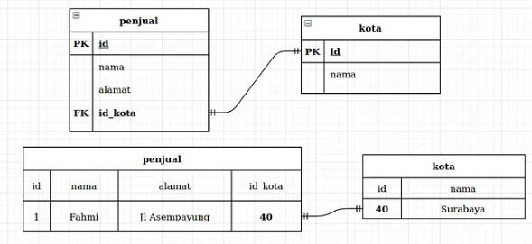

```mysql
create table wallet(
                         id int not null auto_increment,
                         id_customer int not null,
                         balance int not null default 0,
                         primary key (id),
                         unique key fk_id_customer_unique(id_customer),
                         constraint fk_id_wallet_customer
                             foreign key (id_customer) references customers(id)
) engine = InnoDB;

insert into wallet(id_customer, balance) values(1,1000000000);
select * from wallet;

```

### One to Many Relationship

tabel a memiliki banyak relasi di tabel b.

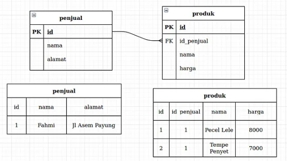

```mysql
# buat tabel categories
create table categories(
                          id varchar(10) not null ,
                          name varchar(100) not null ,
                          primary key (id)
) engine = InnoDB;

# hapus kolom category di tabel products
alter table products
   drop column category;

# tambah kolom id_category di tabel products
alter table products
   add column id_category varchar(10);

# tambah relasi dari tabel products ke categories
alter table products
   add constraint fk_products_categories
      foreign key (id_category) references categories(id);

# cek perubahan tabel products
show create table products;

# cek data products
select *
from products;

# tambah data categories
insert into categories(id, name)
values ('C001', 'Makanan'),
       ('C002', 'Minuman'),
       ('C003', 'Lain-lain');

# cek data categories
select * from categories;

# update tabel products dengan category "makanan"
update products set id_category = 'C001'
where id in (
             'P001',
             'P002',
             'P003',
             'P004',
             'P005',
             'P013',
             'P014',
             'P015'
   );

# update tabel products dengan category "minuman"
update products set id_category = 'C002'
where id in (
             'P006',
             'P007',
             'P008',
             'P009',
             'P012'
   );

# update tabel products dengan category "lain-lain"
update products set id_category = 'C003'
where id in (
             'P011',
             'P010'
   );

# Join
select p.id, p.name, c.name
from products p
        join categories c on p.id_category = c.id;

```


### Many to Many Relationship
- Realasi ini adalah relasi yang paling kompleks
- relasi dimana ada relasi antara 2 tabel dimana tabel a memiliki banyak relasi di tabel b dan tabel b memiliki banyak relasi di tabel a.
- Contoh dalam relasi antara tabel produk dan penjualan, dimana setiap produk bisa dijual berkali-kali dan setiap penjualan bisa untuk lebih dari satu peoduk.

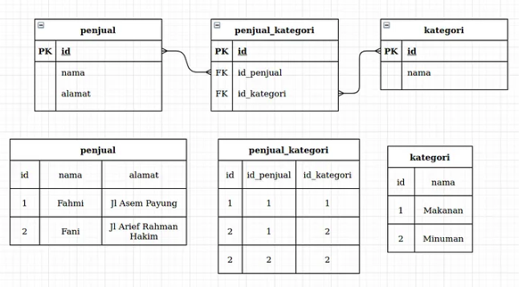


```mysql
# buat tabel orders
create table orders(
    id int not null auto_increment,
    total int not null ,
    order_date datetime not null default current_timestamp,
    primary key (id)
) engine = InnoDB;

desc orders;

# buat tabel relasi
create table order_detail(
    id_product varchar(10) not null ,
    id_order int not null ,
    price int not null ,
    quantity int not null ,
    primary key (id_product, id_order)
) engine = InnoDB;

desc order_detail;

# buat foreign key
alter table order_detail
    add constraint fk_orders_detail_product
        foreign key (id_product) references products(id);

alter table order_detail
    add constraint fk_orders_detail_orders
        foreign key (id_order) references orders(id);

show create table order_detail;

# tambah data order details
select * from orders;
insert into orders(total) values (50000), (100000), (150000);

insert into order_detail(id_product, id_order, price, quantity)
values ('P001', 1, 25000, 1),
       ('P002', 1, 25000, 1),
       ('P003', 2, 25000, 1),
       ('P001', 2, 25000, 1),
       ('P003', 3, 25000, 1),
       ('P004', 3, 25000, 1);

select * from order_detail;

# Join
select *
from orders o
join order_detail od on o.id = od.id_order
join products p on p.id = od.id_product;
```


### Jenis-jenis join
#### Inner Join
- Inner Join adalah mkaniseme join dimana terdapat relasi antara tabel pertama dan tabel kedua.
- Jika kedua tabel tidak memiliki relasi maka inner join tidak akan ditampilkan.
- Inner Join adalah default join di mysql

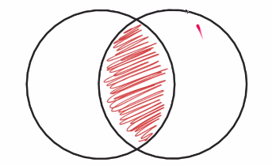

```mysql
select * from products;

insert into categories (id, name)
values ('C004', 'Oleh-oleh'), ('C005', 'Gadged');

insert into products (id, name, price, quantity)
values ('X001', 'x satu', 25000, 200),
       ('X002', 'x dua', 15000, 100),
       ('X003', 'x tiga', 20000, 50);

select *
from categories c
inner join products p on c.id = p.id_category;
```

#### Left Join
- Left Join adalah mekanisme join seperti inner join, namun semua data di table pertama akan diambil juga
- Jika ada yang tidak memiliki relasi di tabel kedua, maka hasilnya akan null.

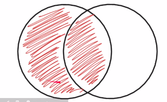

```mysql
select *
from categories c
left join products p on c.id = p.id_category;


select c.id, c.name, p.id, p.name
from categories c
        left join products p on c.id = p.id_category;

```
#### Right Join

```mysql
select *
from categories c
right join products p on c.id = p.id_category;

select c.id, c.name, p.id, p.name
from categories c
        right join products p on c.id = p.id_category;

```
#### Cross Join
- cross join adalah salah satu join yang sangat jarang sekali digunakan
- cross join, melakukan join dengan cara mengalikan data di tabel pertama dengan data fi tabel kedua
- artinya jika ada 5 data di tabel pertama dan 5 data di tabel kedua, akan menghasilkan kombinasi data (5x5)


```mysql
select c.id, c.name, p.id, p.name
from categories c
        cross join products p;
```

**coba iseng buat perkalian**

```mysql
create table numbers(
    id int not null,
    primary key (id)
) engine = InnoDB;


insert into numbers(id) values (0),(1),(2),(3),(4),(5),(6),(7),(8),(9);

select * from numbers;

select numbers1.id as 'number 1',
       numbers2.id as 'number 2',
       numbers1.id + numbers2.id as penjumlahan,
       numbers1.id - numbers2.id as pengurangan,
       numbers1.id * numbers2.id as perkalian,
       numbers1.id / numbers2.id as pembagian
from numbers as numbers1
        cross join numbers as numbers2
order by numbers1.id, numbers2.id;

```

### Subquery di Where
- My Sql mendukung pencarian data menggunakan WHERE dari hasil SELECT query
- Fitur ini dinamakan subquery
- Contoh: kita ingin mencari products yang harganya diatas rata-rata artinya kita akan melakukan SELECT dengan WHERE price > harga rata-rata, dimana harga rata-rata perlu kita hitung menggunakan query SELECT lainnya menggunakan aggregate function AVG

```mysql
# menampilkan harga di atas rata-rata
select p.id,
       p.name,
       p.price,
       (select avg(price) from products) as avg_price
from products p
where price > (select avg(price) from products);

# menampilkan harga termahal yang memiliki category
select max(cp.price)
from (select price
      from categories c
          inner join products p on c.id = p.id_category) as cp;
```

### Set Operator

```mysql
# Persiapan data
create table guestbooks(
    id int not null auto_increment,
    email varchar(100) not null,
    title varchar(200) not null,
    content text,
    primary key (id)
) engine = InnoDB;

select * from customers;
insert into guestbooks(email, title, content)
values ('guest1@gmail.com', 'Hello', 'Hello'),
       ('guest2@gmail.com', 'Hello', 'Hello'),
       ('guest3@gmail.com', 'Hello', 'Hello'),
       ('test@gmail.com', 'Hello', 'Hello'),
       ('test@gmail.com', 'Hello', 'Hello'),
       ('test@gmail.com', 'Hello', 'Hello');


select * from guestbooks;
```

MySql mendukung operator Set, dimana ini adalah operasi antara hasil dari dua SELECT query. Ada banyak jenis operator set, yaitu:
- UNION, Operasi menggabungkan dua buah SELECT query, dimana jika terdapat data yang duplicate, data duplicatenya akan dihapus.
   
   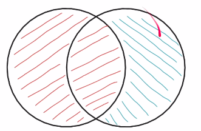

   ```mysql
   # Jika ada data yang sama akan di merge / digabung
   select distinct email from customers
   union
   select distinct email from guestbooks;
   ```

- UNION ALL, operasinya sama dengan Union namun data duplicatenya akan tetap di tampilkan.

   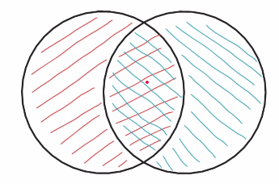

   ```mysql
   # Jika ada data yang sama akan di merge / digabung
   select distinct email from customers
   union all
   select distinct email from guestbooks;
   
   # menghitung berapa kali email muncul
   select emails.email,
          count(emails.email) as count_email
   from (select email from customers
         union all select email from guestbooks) as emails
   group by emails.email;
   ```

- INTERSECT, operasi menggabungkan dua query, namun yang diambil hanya data yang terdapat pada hasil query pertama dan query kedua. Ini mirip sperti inner join. Data nya tidak akan duplicate. Sayangnya, Mysql tidak memiliki operator INTERSECT, dengan demikian untuk melakukan operasi INTERSECT, kita harus lakukan secara manual menggabungkan JOIN atau SUBQUERY.

   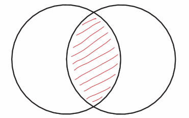

   ```mysql
   # sub query
   select distinct email from customers
   where email in (select distinct email from guestbooks);
   
   # inner join
   select distinct customers.email from customers
   inner join guestbooks g on customers.email = g.email;
   ```

- MINUS, operasi dimana query pertama akan dihilangkan oleh query kedua. Artinya jika ada data yang ada diquery kedua, maka data tersebut akan dihapus dari hasil query MINUS. Sayangnya, di MYSQL juga tidak ada operator MINUS, namun hal ini bisa kita lakukan menggunakan JOIN.

   

    ```mysql
    select distinct c.email, g.email from customers c
    left join guestbooks g on c.email = g.email
    where g.email is null;
    ```

### Transaction
**Kenapa butuh transaction**
- Saat membuat aplikasi berbasis database, jarang sekali kita akan melakukan satu jenis perintah SQL per aksi yang dibuat aplikasi
- Contoh, ketika membuat toko online, ketika customer menekan tombol pesan, banyak yang harus kita lakukan, misal
  - membuat data pesanan di tabel order
  - membuat data detail di tabel order detail
  - menurunkan quantity di tabel produk
  - dan lain-lain
- Artinya bisa saja dalam satu aksi, kita akan melakukan beberapa perintah sekaligus
- Jika terjadi kesalahan di salah satu perintah, harapannya adalah perintah-perintah sebelumnya dibatalkan, agar data tetap konsisten.
  
**Database Transaction**
- Database transaction adalah fitur di DBMS diman kita bisa memungkinkan beberapa perintah dianggap menjadi sebuah kesatuan perintah yang disebut transaction.
- Jika terdapat satu saja proses gagal di transaction, maka secara otomatis perintah-perintah sebelumnya akan dibatalkan
- Jika sebuah transaction sukses, maka semua perintah dipastikan sukses.

**Membuat transaction**

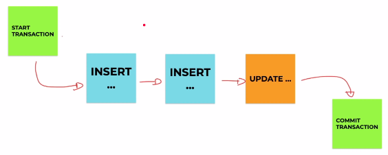

**Membatalkan transaction**

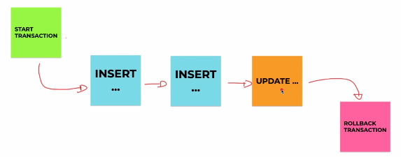

| Perintah          | Keterangan                                                                                                |
|-------------------|-----------------------------------------------------------------------------------------------------------|
| START TRANSACTION | Memulai proses transaksi, proses selanjutnya akan dianggap transaksi sampai perintah COMMIT atau ROLLBACK |
| COMMIT            | Menyiapkan secara permanen seluruh proses transaksi                                                       |
| ROLLBACK          | Membatalkan secara permanen seluruh proses transaksi                                                      |

```mysql
# commit
start transaction;
insert into guestbooks(email, title, content)
values ('contoh@gmail.com','Contoh','Contoh'),
       ('contoh1@gmail.com','Contoh1','Contoh1'),
       ('contoh2@gmail.com','Contoh2','Contoh2');
commit;

# rollback
start transaction;
delete from guestbooks;

rollback;
```

**Yang tidak bisa menggunakan transaction**
- Perintah DDL (Data Definition Language) tidak bisa menggunakan fitur transaction
- DDL adalah perintah-perintah yang digunakan untuk merubah struktur seperti membuat/menghapus tabel, menambah/menghapus kolom, menghapus database, dan sejenisnya.
- Transaction hanya bisa dilakukan pada perintah DML (Data Manipulation Language), seperti operasi insert update dan delete.


### Locking
- Locking adalah proses mengunci data di DBMS
- Proses mengunci data sangat penting salah satunya agar data benar-benar terjamin konsistensinya
- Karena pada kenyataanya, aplikasi yang akan kita buat pasti digunakan oleh banyak pengguna, dan banyak pengguna tersebut bisa saja akan mengakses data yang sama, jika tidak ada proses locking, bisa dipastikan akan terjadi RACE CONDITION, yaitu proses balapan ketika mengubah data yang sama.
- Contoh saja, ketika kita belanja di toko online, kita akan balapan membeli barang yang sama, jika data tidak terjaga, bisa jadi kita salah mengupdate stock karena pada saat yang bersamaan banyak yang melakukan perubahan stock barang.

**Locking Record**
- Saat kita melakukan proses TRANSACTION, lalu kita melakukan proses perubahan data, data yang kita ubah tersebut akan secara otomastis di LOCK.
- Hal ini membuat proses TRANSACTION sangat aman.
- Oleh karena itu, sangat disarankan untuk selalu menggunakan fitur TRANSACTION ketika memanipulasi data di database, terutama ketika perintah manipulasinya lebih dari satu kali
- Locking ini akan membuat sebuah proses perubahan yang dilakukan oleh pihak lain akan diminta untu menunggu.
- Data akan di LOCK sampai kita melakukan COMMIT atau ROLLBACK transaction tersebut.
- LOCK otomatis sama seperti kita menggunakan transaction

```mysql
start transaction ;

update products
set name = 'diubah user 1'
where id = 'P001';

commit;
```

```mysql
start transaction ;

update products
set name = 'diubah user 2'
where id = 'P001';

commit;
```
**Locking Record Manual**
- Selain secara otomatis, kadang saat kita membuat aplikasi, kita juga sering melakukan SELECT query terlebih dahulu sebelum melakukan proses UPDATE misalnya.
- Jika kita ingi melakukan locking sebuah data secara manual, kita bisa tambahkan perintah FOR UPDATE di belakang query SELECT
- Saat kita lock record yang kita select, maka jika ada proses lain akan melakukan UPDATE, DELETE atau SELECT FOR UPDATE lagi, maka proses lain diminta menunggu sampai kita selesai melakukan COMMIT atau ROLLBACK transaction.

```mysql
# user 1
start transaction ;

# untuk menjaga konsistensi saat select
select * from products where id = 'P001' for update;

update products 
set quantity = quantity - 100
where id = 'P001';

commit;
```

```mysql
# user 2
start transaction ;

# untuk menjaga konsistensi saat select
select * from products where id = 'P001' for update;

update products 
set quantity = quantity - 10
where id = 'P001';

commit;
```


### Deadlock
- Saat kita terlalu banyak melakukan proses LOCKING, hati-hati akan masalah yang bisa terjadi yaitu DEADLOCK.
- DEADLOCK adalah situasi ada 2 proses yang saling menunggu satu sama lain, namun data yang ditunggu dua-duanya di lock oleh proses lainnya, sehingga proses menunggunya ini tidak akan pernah selesai.

**Contoh:**
- proses 1 melakukan SELECT FOR UPDATE untuk data 001
- proses 2 melakukan SELECT FOR UPDATE untuk data 002
- proses 1 melakukan SELECT FOR UPDATE untuk data 002, diminta menunggu karena dilock oleh proses 2
- proses 2 melakukan SELECT FOR UPDATE untuk data 001, diminta menunggu karena dilock oleh proses 1
- Akhirnya proses 1 dan proses 2 saling menunggu
- Deadlock terjadi

```mysql
start transaction;
# user 1
select * from products where id = 'P001' for update;
select * from products where id = 'P002' for update;

```

```mysql
start transaction;
# user 2
select * from products where id = 'P001' for update;
select * from products where id = 'P002' for update;

```


### Locking Table
- MySql mendukung proses locking terhadap sebuah tabel
- Jika kita me-lock tabel, artinya seluruh data di table tersebut akan di lock
- Ada 2 jenis lock tabel, yaitu READ dan WRITE
- Cara melakukan locking table adalah dengan perintah
  - LOCK TABLES nama_tabel READ
  - LOCK TABLES nama_tabel WRITE
- Setelah selesai melakukan lock tabel, kita bisa melakukan unlock dengan perintah: UNLOCK

| Perintah | Proses yang melakukan LOCK                             | Proses Lain                                                                       |
|----------|--------------------------------------------------------|-----------------------------------------------------------------------------------|
| READ     | Hanya bisa melakukan read terhadap tabel tersebut      | Hanya bisa melakukan read terhadap tabel tersebut, dan tidak bisa melakukan write |
| WRITE    | Bisa melakukan read dan write terhadap tabel tersebut  | Tidak bisa melakukan read dan write                                               |

```mysql
# read
lock tables products read;

# write
lock tables products write;

# unlock
unlock tables;

```

### Lock Instance
- Salah satu fitur lock lainnya di MySql adalah lock instance
- Lock instance adalah perintah locking yang akan membuat perintah DDL (data definition language) akan diminta menunggu sampai proses unlock instance
- Biasanya proses locking instance ini terjadi ketika ingin melakukan backup data, agar tidak terjadi perubahan terhadap strukture tabel, misalnya kita bisa melakukan locking instance
- Setelah proses backup selesai, baru kita unlock lagi instance-nya
- Untuk melakukan locking instance, kita bisa gunakan perintah: LOCK INSTANCE FOR BACKEND
- Untuk melakukan unlocking instance kita bisa menggunakan perintah: UNLOCK INSTANCE

```mysql
lock instance for backup;

unlock instance;
```

### User Management
#### Root User
- Secara default, mysql membuat root user sebagai super administrator
- Namun best practice nya, saat kita menjalankan MySql dengan aplikasi yang kita buat, sangat disarankan tidak menggunakan user root
- Lebih baik kita buat user khusus untuk tiap aplikasi, bahkan kita bisa batasi hak akses user tersebut, seperti hanya bisa melakukan select dan tidak boleh melakukan insert, update atau delete
- Daftar hak akses: https://dev.mysql.com/doc/refman/8.0/en/grant.html

**Table Permissible Static Privileges for GRANT and REVOKE**

| Privilege               | 	Meaning and Grantable Levels                                                                                                                            |
|-------------------------|----------------------------------------------------------------------------------------------------------------------------------------------------------|
| ALL [PRIVILEGES]        | Grant all privileges at specified access level except GRANT OPTION and PROXY.                                                                            |                                                                                                          |
| ALTER                   | Enable use of ALTER TABLE. Levels: Global, database, table.                                                                                              |                                                                                                                            
| ALTER ROUTINE           | Enable stored routines to be altered or dropped. Levels: Global, database, routine.                                                                      |                                                                                                    
| CREATE                  | Enable database and table creation. Levels: Global, database, table.                                                                                     |                                                                                                                  
| CREATE ROLE             | Enable role creation. Level: Global.                                                                                                                     |                                                                                                                                         
| CREATE ROUTINE          | Enable stored routine creation. Levels: Global, database.                                                                                                |                                                                                                                               
| CREATE TABLESPACE       | Enable tablespaces and log file groups to be created, altered, or dropped. Level: Global.                                                                |                                                                                              
| CREATE TEMPORARY TABLES | Enable use of CREATE TEMPORARY TABLE. Levels: Global, database.                                                                                          |                                                                                                                         
| CREATE USER             | Enable use of CREATE USER, DROP USER, RENAME USER, and REVOKE ALL PRIVILEGES. Level: Global.                                                             |                                                                                          
| CREATE VIEW             | Enable views to be created or altered. Levels: Global, database, table.                                                                                  |                                                                                                                
| DELETE                  | Enable use of DELETE. Level: Global, database, table.                                                                                                    |                                                                                                                                  
| DROP                    | Enable databases, tables, and views to be dropped. Levels: Global, database, table.                                                                      |                                                                                                    
| DROP ROLE               | Enable roles to be dropped. Level: Global.                                                                                                               |                                                                                                                                             
| EVENT                   | Enable use of events for the Event Scheduler. Levels: Global, database.                                                                                  |                                                                                                                 
| EXECUTE                 | Enable the user to execute stored routines. Levels: Global, database, routine.                                                                           |                                                                                                         
| FILE                    | Enable the user to cause the server to read or write files. Level: Global.                                                                               |                                                                                                            
| GRANT OPTION            | Enable privileges to be granted to or removed from other accounts. Levels: Global, database, table, routine, proxy.                                      |                                                                     
| INDEX                   | Enable indexes to be created or dropped. Levels: Global, database, table.                                                                                |                                                                                                               
| INSERT                  | Enable use of INSERT. Levels: Global, database, table, column.                                                                                           |                                                                                                                          
| LOCK TABLES             | Enable use of LOCK TABLES on tables for which you have the SELECT privilege. Levels: Global, database.                                                   |                                                                              
| PROCESS                 | Enable the user to see all processes with SHOW PROCESSLIST. Level: Global.                                                                               |                                                                                                          
| PROXY                   | Enable user proxying. Level: From user to user.                                                                                                          |                                                                                                                          
| REFERENCES              | Enable foreign key creation. Levels: Global, database, table, column.                                                                                    |                                                                                                                
| RELOAD                  | Enable use of FLUSH operations. Level: Global.                                                                                                           |                                                                                                                                        
| REPLICATION CLIENT      | Enable the user to ask where source or replica servers are. Level: Global.                                                                               |                                                                                                             
| REPLICATION SLAVE       | Enable replicas to read binary log events from the source. Level: Global.                                                                                |                                                                                                              
| SELECT                  | Enable use of SELECT. Levels: Global, database, table, column.                                                                                           |                                                                                                                          
| SHOW DATABASES          | Enable SHOW DATABASES to show all databases. Level: Global.                                                                                              |                                                                                                                              
| SHOW VIEW               | Enable use of SHOW CREATE VIEW. Levels: Global, database, table.                                                                                         |                                                                                                                       
| SHUTDOWN                | Enable use of mysqladmin shutdown. Level: Global.                                                                                                        |                                                                                                                                     
| SUPER                   | Enable use of other administrative operations such as CHANGE REPLICATION SOURCE TO, CHANGE MASTER TO, KILL, PURGE BINARY LOGS, SET GLOBAL, and mysqladmin debug command. Level: Global. | 
| TRIGGER                 | Enable trigger operations. Levels: Global, database, table.                                                                                              |                                                                                                                            
| UPDATE                  | Enable use of UPDATE. Levels: Global, database, table, column.                                                                                           |                                                                                                                         
| USAGE                   | Synonym for “no privileges”                                                                                                                              |                                                                                                                                                           


**Table Permissible Dynamic Privileges for GRANT and REVOKE**

| Privilege                   | 	Meaning and Grantable Levels                                                    |
|-----------------------------|----------------------------------------------------------------------------------|
| APPLICATION_PASSWORD_ADMIN  | 	Enable dual password administration. Level: Global.                             |
| AUDIT_ABORT_EXEMPT          | 	Allow queries blocked by audit log filter. Level: Global.                       |
| AUDIT_ADMIN                 | 	Enable audit log configuration. Level: Global.                                  |
| AUTHENTICATION_POLICY_ADMIN | 	Enable authentication policy administration. Level: Global.                     |
| BACKUP_ADMIN                | 	Enable backup administration. Level: Global.                                    |
| BINLOG_ADMIN                | 	Enable binary log control. Level: Global.                                       |
| BINLOG_ENCRYPTION_ADMIN     | 	Enable activation and deactivation of binary log encryption. Level: Global.     |
| CLONE_ADMIN                 | 	Enable clone administration. Level: Global.                                     |
| CONNECTION_ADMIN            | 	Enable connection limit/restriction control. Level: Global.                     |
| ENCRYPTION_KEY_ADMIN        | 	Enable InnoDB key rotation. Level: Global.                                      |
| FIREWALL_ADMIN              | 	Enable firewall rule administration, any user. Level: Global.                   |
| FIREWALL_EXEMPT             | 	Exempt user from firewall restrictions. Level: Global.                          |
| FIREWALL_USER               | 	Enable firewall rule administration, self. Level: Global.                       |
| FLUSH_OPTIMIZER_COSTS       | 	Enable optimizer cost reloading. Level: Global.                                 |
| FLUSH_STATUS                | 	Enable status indicator flushing. Level: Global.                                |
| FLUSH_TABLES                | 	Enable table flushing. Level: Global.                                           |
| FLUSH_USER_RESOURCES        | 	Enable user-resource flushing. Level: Global.                                   |                            
| GROUP_REPLICATION_ADMIN     | Enable Group Replication control. Level: Global.                                 |                      
| INNODB_REDO_LOG_ARCHIVE     | Enable redo log archiving administration. Level: Global.                         |              
| INNODB_REDO_LOG_ENABLE      | Enable or disable redo logging. Level: Global.                                   |                 
| NDB_STORED_USER             | 	Enable sharing of user or role between SQL nodes (NDB Cluster). Level: Global.  |
| PASSWORDLESS_USER_ADMIN     | 	Enable passwordless user account administration. Level: Global.                 |      
| PERSIST_RO_VARIABLES_ADMIN  | Enable persisting read-only system variables. Level: Global.                     |    
| REPLICATION_APPLIER         | 	Act as the PRIVILEGE_CHECKS_USER for a replication channel. Level: Global.      |
| REPLICATION_SLAVE_ADMIN	    | Enable regular replication control. Level: Global.                               |                 
| RESOURCE_GROUP_ADMIN	       | Enable resource group administration. Level: Global.                             |                 
| RESOURCE_GROUP_USER	        | Enable resource group administration. Level: Global.                             |                   
| ROLE_ADMIN                  | Enable roles to be granted or revoked, use of WITH ADMIN OPTION. Level: Global.  |   
| SESSION_VARIABLES_ADMIN     | Enable setting restricted session system variables. Level: Global.               |  
| SET_USER_ID                 | Enable setting non-self DEFINER values. Level: Global.                           |            
| SHOW_ROUTINE                | Enable access to stored routine definitions. Level: Global.                      |                  
| SKIP_QUERY_REWRITE          | Do not rewrite queries executed by this user. Level: Global.                     |            
| SYSTEM_USER                 | Designate account as system account. Level: Global.                              |        
| SYSTEM_VARIABLES_ADMIN      | Enable modifying or persisting global system variables. Level: Global.           |
| TABLE_ENCRYPTION_ADMIN      | Enable overriding default encryption settings. Level: Global.                    |
| TP_CONNECTION_ADMIN         | Enable thread pool connection administration. Level: Global.                     |         
| VERSION_TOKEN_ADMIN         | Enable use of Version Tokens functions. Level: Global.                           |                  
| XA_RECOVER_ADMIN            | Enable XA RECOVER execution. Level: Global.                                      |                                


```mysql
# create user
# diakses hanya melalui localhost
create user 'triyas'@'localhost';
# diakses hanya melalui ip ini
create user 'triyas'@'192.168.100.111';
# dapat dikases dari manapun
create user 'triyas'@'%';

# delete user
drop user 'triyas'@'localhost';
drop user 'triyas'@'192.168.100.111';
drop user 'triyas'@'%';

# Mwnambahkan hak akses
grant select on nama_database.* to 'triyas'@'localhost';
grant select, insert, update, delete on nama_database.* to 'triyas'@'%';

# Melihat hak akses user
show grants for 'triyas'@'localhost';
show grants for 'triyas'@'%';

# menghapus hak akses
revoke select on nama_database.* to 'triyas'@'localhost';
revoke select, insert, update, delete on nama_database.* to 'triyas'@'%';


# mengubah password
set password for 'triyas'@'localhost' = 'rahasia';
set password for 'triyas'@'%' = 'rahasia';
```


### Backup Database
- Saat membuat aplikasi menggunakan database, ada baiknya kita selalu melakukan backup data secara reguler
- Mysql mendukung proses backup database
- untuk melakukan backup database, kita tidak menggunakan perintah SQL, melainkan MySQL menyediakan sebuah aplikasi khusus untuk melakukan backup database, yaitu mysqldump
- Lihat dokumentasi: https://dev.mysql.com/doc/refman/8.0/en/mysqldump.html

**Gunakan Command Line**
```bash
# backup database
mysqldump database_test --user root --password --result-file=/home/triyas/Documents/backup.sql

# atau
mysqldump -u root -p database_test > /home/triyas/Documents/backup.sql

```

### Restore Database
- Selain melakukan backup database, di MySql juga kita bisa melakukan proses restore data dari file hasil backup
- untuk melakukan restore database, kita bisa menggunakan aplikasi mysql client atau menggunakan perintah SOURCE di Mysql

**Gunakan Command Line**
```bash
# backup database
mysql --user=root --password database_import < /home/triyas/Documents/backup.sql

# atau
mysql -u root -p database_import <  /home/triyas/Documents/backup.sql

```

**Menggunakan SOURCE**

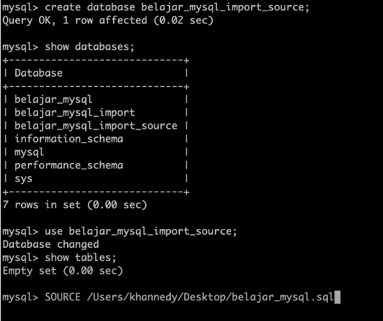

**output** <br><br>

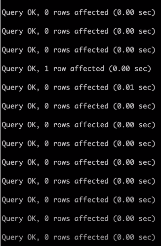

**SELAMAT ANDA TELAH MENYELESAIKAN DATABASE DASAR !!!**

## Next Learning
- Studi kasus Database Design
- Belajar Bahasa pemrograman
- MySql Tuning
- MySql Scalability

## Reference:
- https://david.dev/how-to-install-mariadb-phpmyadmin-with-docker-compose
- https://www.w3resource.com/mysql/mysql-data-types.php
- https://www.youtube.com/watch?v=xYBclb-sYQ4
- https://dev.mysql.com/doc/refman/8.0/en/data-types.html
- https://github.com/triyasmkom/mysql-dasar-docker
